# Medieval Mayhem FMS Operator Manual

How to build, set up and run the field management system (FMS) for Medieval Mayhem 2026. It is written for the FMS
operator; scorers and referees have their own short manuals, [SCORER_MANUAL.md](SCORER_MANUAL.md) and
[REFEREE_MANUAL.md](REFEREE_MANUAL.md).

1. [Overview](#1-overview)
2. [Development and local testing](#2-development-and-local-testing)
3. [Preparing for Medieval Mayhem](#3-preparing-for-medieval-mayhem)
4. [Running Medieval Mayhem](#4-running-medieval-mayhem)
5. [Appendix](#5-appendix)

## 1. Overview

The FMS is [Cheesy Arena](https://github.com/Team254/cheesy-arena) with a few things M-Ayhem doesn't use removed and
a few it needs added: 2v2 matches, the M-Ayhem Arduino PLC, and playoffs with one game per round until a best-of-3
final. This year's game, Medieval Mayhem, is applied on top. [DEVELOPMENT.md](DEVELOPMENT.md) has the details.

It is a web server. Everyone uses it through a browser: the operator on a laptop, scorers and referees on tablets,
and every screen in the venue is a browser showing one of its display pages.

**Who does what**

| Role | Uses | Does |
|---|---|---|
| FMS operator | Match Play and the Setup pages | Sets up the event, loads and starts matches, runs alliance selection and awards |
| Head referee | Head referee page | Enters fouls and cards, posts each score |
| Referees | Referee page | Enter fouls |
| Near scorers, one per alliance | Near scoring page | Enter treasures |
| Far scorers, one per alliance | Far scoring page | Enter robots, the crown and the toss |
| Announcer | Announcer display | Sees teams, schools, ranks and results |
| Queuer | Queue display | Sees the next matches |
| FTA | Field monitor | Watches robot connections |

**The pieces**

- **The FMS computer** runs the server and keeps the event in one file, `event.db`.
- **The field network** connects the FMS computer, the driver stations, the access point the robots connect to, and
  the Arduino PLC (e-stops and stack lights).
- **Displays**: any computer or TV stick with Chrome, pointed at a display page: the audience display for the
  stream and the big screen, the match queue, rankings, the screens above the driver stations.
- **Tablets** for the scorers and referees, on the FMS Wi-Fi.

## 2. Development and local testing

### Install Go and Git

The FMS is built from source with [Go](https://go.dev). Use the version in `go.mod` (currently Go 1.26) or newer.

**Windows**

1. Download the Windows installer (`.msi`) from [go.dev/dl](https://go.dev/dl/) and run it.
2. Download Git from [git-scm.com/download/win](https://git-scm.com/download/win) and install it with the defaults.
3. Open a new PowerShell window and check both:

   ```powershell
   go version
   git --version
   ```

**Mac**

1. Download the macOS installer (`.pkg`; Apple silicon is `arm64`, Intel is `amd64`) from
   [go.dev/dl](https://go.dev/dl/) and run it. If you use Homebrew, `brew install go` works too.
2. Install Git with the Xcode command line tools:

   ```bash
   xcode-select --install
   ```

3. Open a new Terminal window and check both:

   ```bash
   go version
   git --version
   ```

**Linux**

1. Download the Linux archive from [go.dev/dl](https://go.dev/dl/) and install it (replace the file name with the
   one you downloaded):

   ```bash
   sudo rm -rf /usr/local/go && sudo tar -C /usr/local -xzf go1.26.0.linux-amd64.tar.gz
   echo 'export PATH=$PATH:/usr/local/go/bin' >> ~/.profile && source ~/.profile
   ```

2. Install Git with your package manager, for example `sudo apt install git`.
3. Check both with `go version` and `git --version`.

### Clone and build

```bash
git clone https://github.com/Team766/mayhem-fms.git
cd mayhem-fms
go build
```

This makes `cheesy-arena` (Mac, Linux) or `cheesy-arena.exe` (Windows) in the same folder. To update later, run
`git pull` and `go build` again.

### Run it on your computer

```bash
./cheesy-arena -dev
```

On Windows, run `.\cheesy-arena.exe -dev`. Then open [http://localhost:8080](http://localhost:8080) in Chrome.
`-dev` lets it run on any network address, which is what you want without robots. Windows may ask whether to allow
network access; allow it on private networks.

The event lives in `event.db` in the folder you started it from, and automatic backups go to `db/backups/`. To start
over with an empty event, stop the FMS (Ctrl+C), move `event.db` somewhere else, and start it again.

### A test match without robots

1. Open **Run > Match Play** and click **Load Test Match**.
2. Click **B** in the Byp column for every station that has no robot. A station needs a robot connected or a bypass
   before the match can start.
3. Click **Start Match**. The match runs its full length; open the scoring pages (Panel menu) in other tabs to try
   them.
4. When it ends, click **Commit & Post**. A test match is never saved.

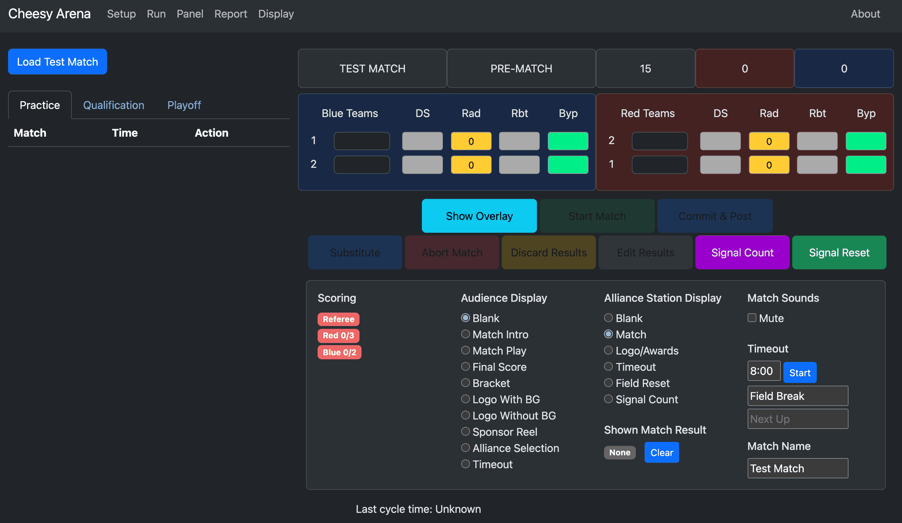

### A test competition

Do the steps in [Preparing for Medieval Mayhem](#3-preparing-for-medieval-mayhem) and
[Running Medieval Mayhem](#4-running-medieval-mayhem) with made-up teams. To fill in a schedule quickly, play a few
matches for real and enter the rest in **Run > Match Review > Edit**; a result saved there counts like a played match.
When you are done, stop the FMS and move `event.db` away.

### Changing how it looks and sounds

Everything is a file under `static/`. Replace a file with your own, keeping its name, format and shape, then reload
the displays (**Setup > Display Configuration > Force Reload of All Displays**). No rebuild is needed.

| What | File | Notes |
|---|---|---|
| Match clock logo on the audience overlay | `static/img/game-logo.png` | Square, shown as a circle |
| Full-screen logo (Logo modes) | `static/img/blinds-logo.png` | Square |
| Logo on the screens above the driver stations | `static/img/alliance-station-logo.png` | Tall |
| Logo next to lower thirds and award names | `static/img/lower-third-logo.png` | Currently the FIRST logo |
| Final score background | `static/img/endofmatch-bg.png` | 1920×1080 |
| Team logos | `static/img/avatars/<team number>.png` | Small square PNG, for example 128×128; none needed |
| Sponsor slides | `static/img/sponsors/<file>` | Create the folder first |
| Overlay colors | `static/css/display_overlay_shared.css` | Red `#ff4444`, blue `#2080ff`, accent `#fc0` |
| Scoring tablet colors | `static/css/scoring_panel.css` | |
| Display font | `static/css/fonts/futura-lt*.otf` | |
| Sounds | `static/audio/*.wav` | Keep the names; see below |

| Sound | Plays when |
|---|---|
| `start.wav` | The match starts |
| `end.wav` | Autonomous ends, and the match ends |
| `resume.wav` | Teleop starts |
| `warning.wav` | Endgame starts (30 s left) |
| `toss.wav` | The toss opens (20 s left) |
| `abort.wav` | A match is aborted |
| `match_result.wav` | The final score is shown |
| `pick_clock.wav`, `pick_clock_expired.wav` | Alliance selection timer: 5 s left, and time up |
| `field_reset.wav` | Signal Reset |

Sounds play only from the audience display page, so that page needs speakers and its browser must allow audio. Test
each one from **Setup > Field Testing**.

### Where the game lives

The scoring rules are in [specs/game_spec.yaml](../specs/game_spec.yaml) and the foul list in
[specs/RULES.md](../specs/RULES.md). To change the game, follow [agents/apply-game.md](agents/apply-game.md).

## 3. Preparing for Medieval Mayhem

### The production setup

- **One dedicated FMS computer**, plugged in, with sleep turned off. Build from the release tag for the event, not a
  branch someone is still changing.
- **Its address is 10.0.100.5** on the field network (a fixed address, not DHCP). Driver stations look for the FMS
  there. Run it without `-dev`: `./cheesy-arena`.
- **The field network stays separate from the venue network.** Each team's driver station is on its own VLAN and
  can reach the FMS only for the driver station connection, not its web pages.
- **The Arduino PLC** is at 10.0.100.15. Bench-test it with [ArduinoPlc.md](ArduinoPlc.md) and **Setup > Field
  Testing**.
- **The access point and switch**, if you use per-team Wi-Fi: a Vivid-Hosting VH-113 access point at 10.0.100.2 and
  a Cisco switch at 10.0.100.3.
- **Displays** are on the field network too, each a browser on a display page (see [Displays](#displays)).
- **Tablets** join the FMS Wi-Fi. Keep its password to the people who need it.
- **Backups:** the FMS saves a copy of the event after every match in `db/backups/`. At each break, also use
  **Setup > Settings > Save Copy of Database** and keep the file somewhere off the FMS computer.
- **The clock:** match times come from the FMS computer's clock; set it correctly.

### Event settings

Open **Setup > Settings**. Settings can't be saved during a match.

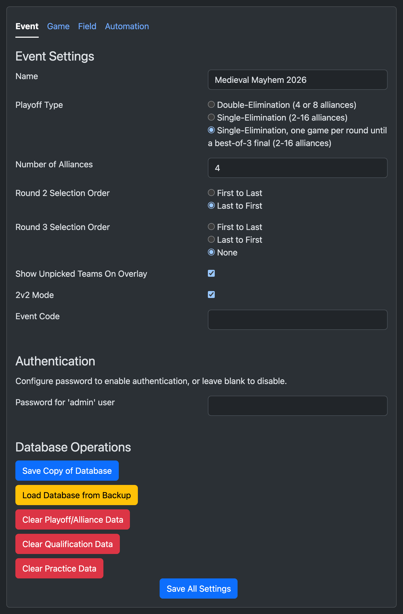

**Event tab**

| Setting | For Medieval Mayhem |
|---|---|
| Name | `Medieval Mayhem 2026` (shown on every screen and report) |
| Playoff Type | Single-Elimination, one game per round until a best-of-3 final |
| Number of Alliances | 4 (or as planned) |
| Round 2 / Round 3 Selection Order | Not used in 2v2 |
| Show Unpicked Teams On Overlay | On |
| 2v2 Mode | **On. Set it before making any schedule.** It locks once the qualification schedule exists |
| Event Code | Optional; the driver stations show it |

**Game tab:** match timing. Keep the defaults: 15 s autonomous, 3 s pause, 120 s teleop, and the endgame warning at
30 s left. The toss always opens at 20 s left.

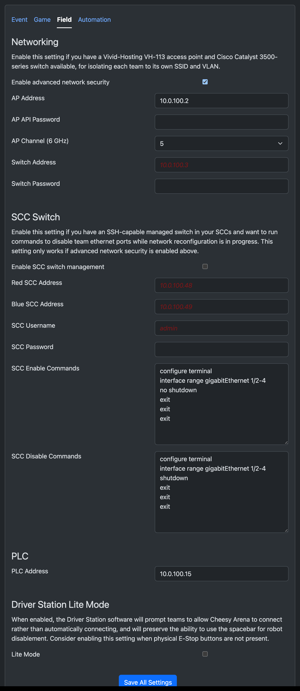

**Field tab**

- **Enable advanced network security:** on if you use the access point and switch above, with their addresses and
  passwords. This gives each team its own Wi-Fi network and VLAN.
- **PLC Address:** `10.0.100.15`. Leave it empty when there is no PLC, or no match can start.
- **Lite Mode:** leave off unless the stations have no physical e-stops.

**Automation tab:** turn on **Enabled automated audience display**. After each score is posted, the audience display
shows the score, then the next match's intro, without anyone touching it.

Click **Save All Settings** at the bottom of any tab.

### Optional: an admin password

Without a password, anyone who can reach the FMS can open every page. That is fine when the FMS Wi-Fi is private,
because team laptops can't reach the pages. If you want a password as well:

1. **Setup > Settings > Event > Authentication:** enter a password and save. The username is always `admin`.
2. Set it before you set up the tablets, and log each tablet in during setup. A login lasts until the password
   changes.

It protects the Setup, Match Play, Match Review editing, alliance selection, scoring and referee pages. The displays,
reports and match logs stay open, so display screens never need to log in.

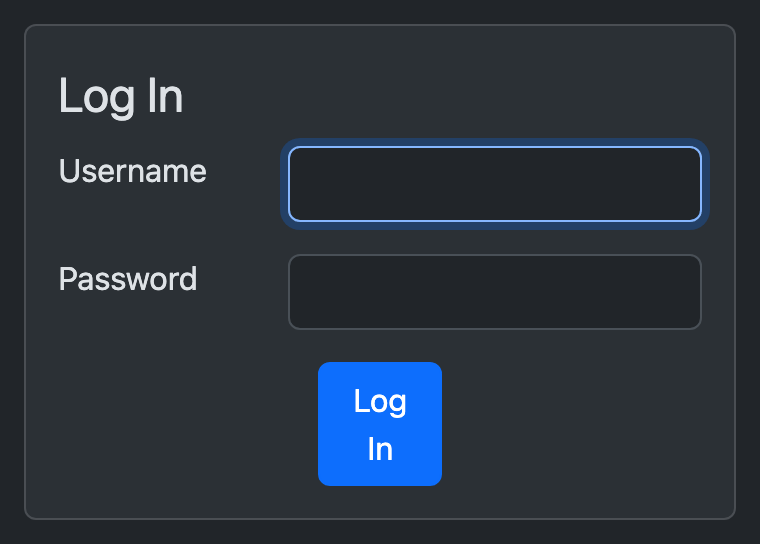

### Teams

**Team numbers.** Give each team a number, in this order of preference:

1. A school with one team uses the school's own team number.
2. A school with several teams, whose number is 2559 or lower, uses its number followed by 1, 2, 3...: a school
   numbered `NNN` has teams `NNN1`, `NNN2`, `NNN3`.
3. A school with several teams whose number is above 2559 gets numbers from 20001 up, with the school's number in
   the team name: for example 20001 and 20002.

No team number may be above 25599. A team's network address is built from its number, and higher numbers don't make
a valid address. The FMS doesn't warn you.

**Adding teams.** **Setup > Team List**: type one number per line and click **Add Teams**.

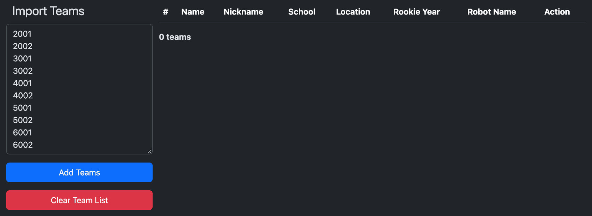

**Team details.** New teams have only a number. Click the pencil next to a team to add its name, nickname, school,
city and robot name. The nickname appears on the displays; the rest appears on the announcer's screen and in
reports.

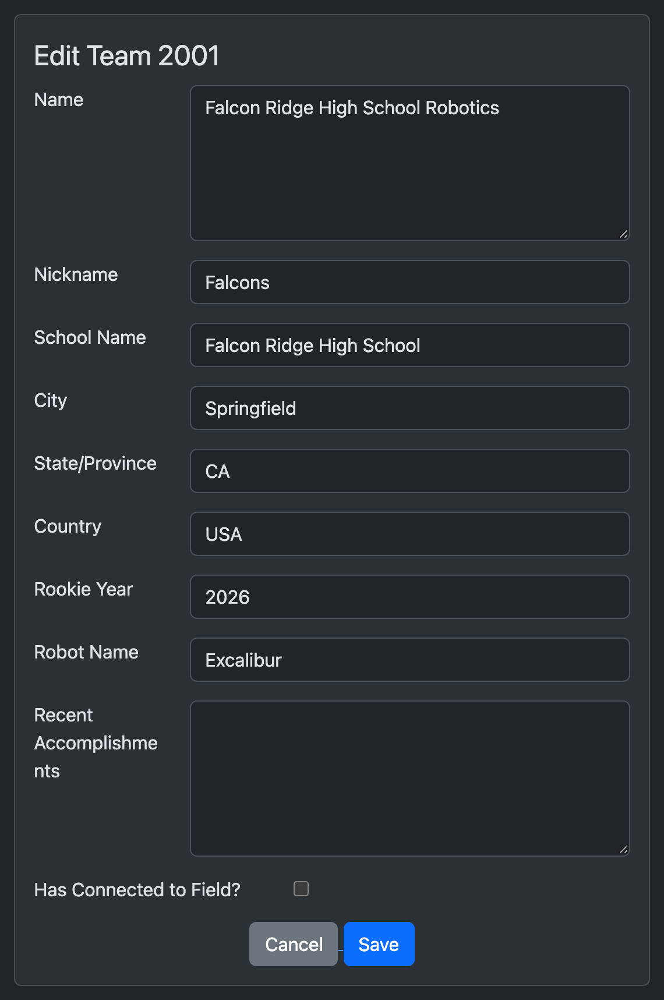

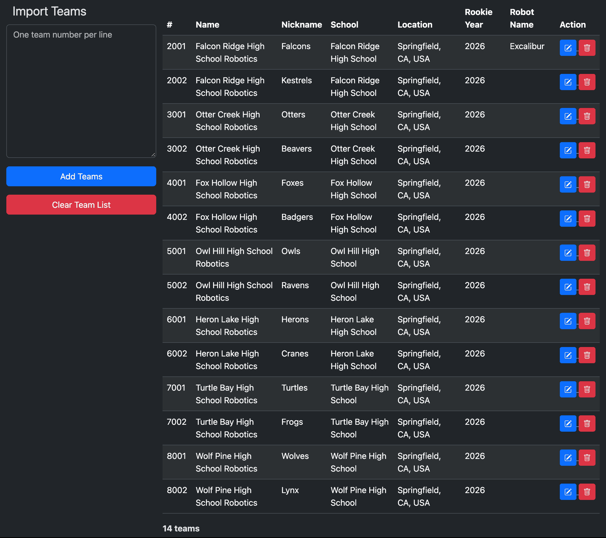

**Team logos** are optional: copy a small square PNG for each team to `static/img/avatars/<team number>.png` on the
FMS computer.

The team list can't change once the qualification schedule exists. Team details can.

### WPA keys and the radio kiosk

With **advanced network security** on, each team's robot radio needs that team's Wi-Fi key (WPA key).

1. **Setup > Team List > Generate Missing WPA Keys** makes a random 8-character key for every team without one.
   **Generate All WPA Keys** replaces every key at once, with no confirmation. Use it only on purpose: radios already
   programmed would stop connecting.
2. To see or change one team's key, edit the team.
3. **Report > WPA Keys** downloads `keys.csv`, one line per team: `team number,key`, with no header.
4. Load that file into the radio programming kiosk (the Vivid-Hosting kiosk's CSV upload). Each team then programs
   its radio at the kiosk.

Before the event, program one radio with a 5-digit team number at the kiosk, to make sure it accepts one.

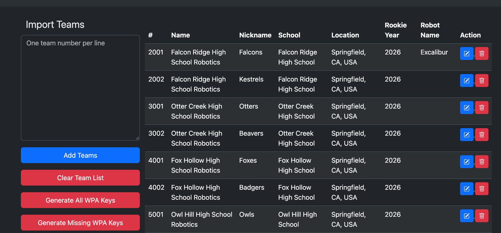

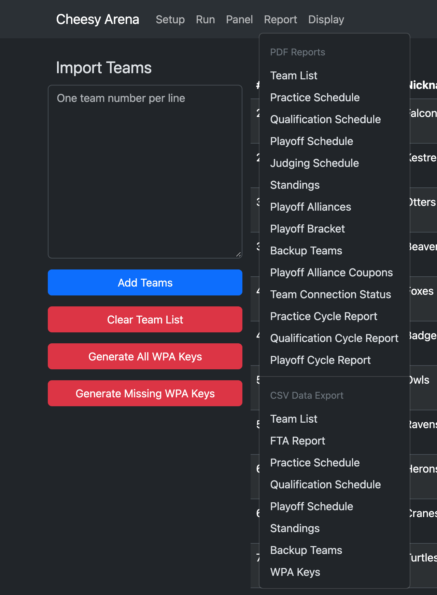

### Schedule

**With 2v2 on, the FMS can schedule exactly 14 teams, at 8, 10 or 12 matches per team** (28, 35 or 42 matches).
Those are the only 2v2 schedule templates it has.

1. **Setup > Match Scheduling**, choose **Qualification**.
2. Set a block's start time, end time and cycle time (6:00 means a match every 6 minutes). Add more blocks for lunch
   or a second day. The page shows the match count and matches per team; adjust the end time until it lands on 8,
   10 or 12 per team.
3. Click **Generate Schedule/Save Blocks** to preview a random schedule. Click it again for a different one.
4. Click **Save Schedule**. This locks the team list and 2v2 mode.

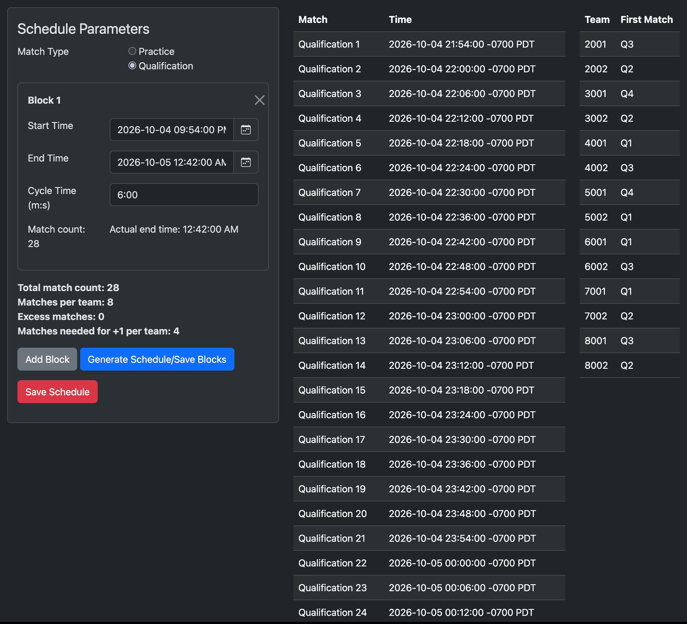

A practice schedule works the same way with **Practice**. Practice results don't count toward rankings.

### Displays

Any browser on the field network can be a display. The simplest way to set one up:

1. On the display's computer, open `http://10.0.100.5:8080/display` in Chrome, full screen (F11). It shows a big
   number, its display ID.
2. On the FMS computer, open **Setup > Display Configuration**. The display is listed under its ID.
3. Give it a nickname (so it stays listed after a disconnect), choose its type, and click the check mark. The display
   switches to that page by itself.

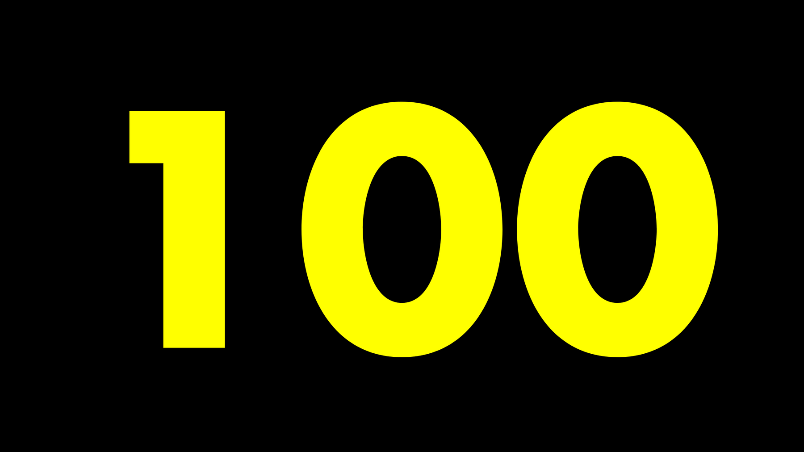

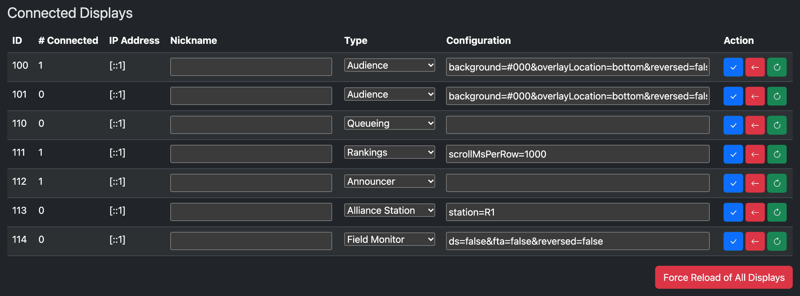

| Display | Shows | Options (Configuration column) |
|---|---|---|
| Audience | The match overlay, final scores, alliance selection, bracket, awards. Plays the sounds | `background=#0f0` for a green screen, `#000` for a TV; `overlayLocation=top` or `bottom`; `reversed=true` puts red on the right |
| Queueing | The match queue: the match on the field and the next four. It fills in once a qualification match is loaded on Match Play | |
| Rankings | The standings, scrolling | `scrollMsPerRow` |
| Alliance Station | One team's number and nickname above its driver station; the score and time during matches | `station=R1`, `R2`, `B1`, `B2` |
| Announcer | Teams, schools, ranks; results as they post | |
| Field Monitor | Robot connections, for the FTA | `fta=true` adds notes |
| Bracket | The playoff bracket | |
| Wall | The overlay on a plain background | |

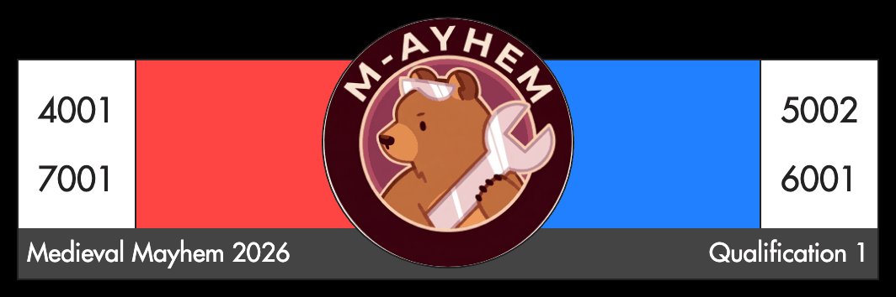

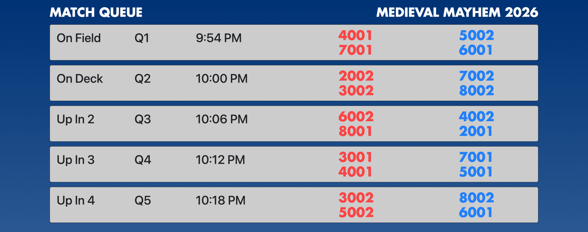

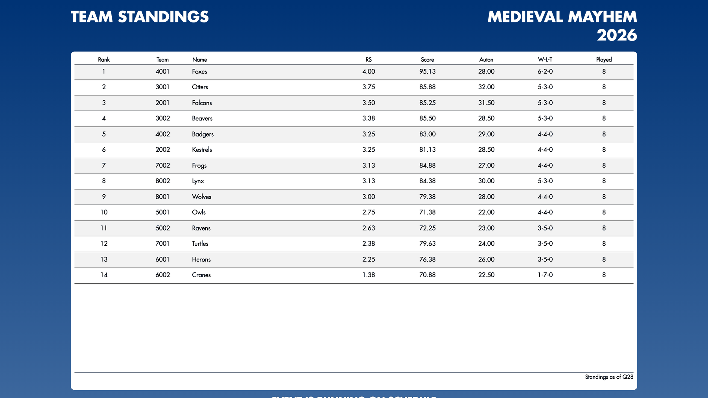

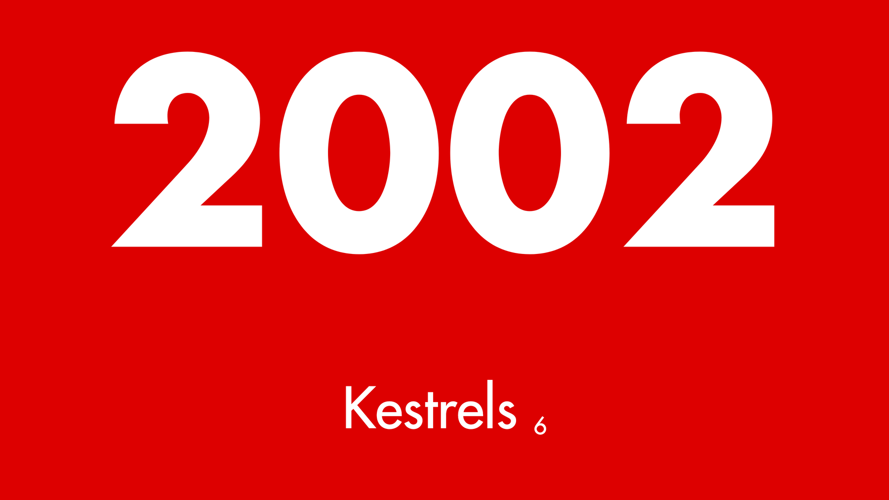

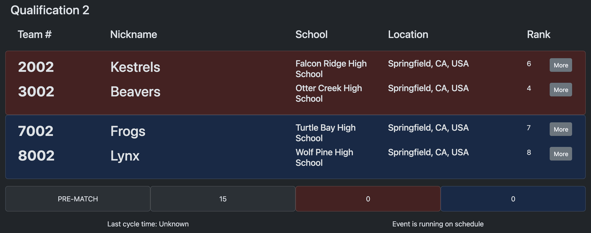

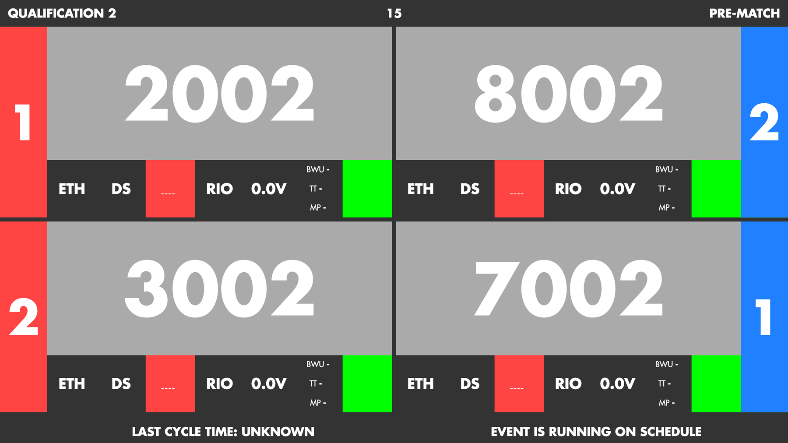

### Scoring and referee tablets

Each alliance needs a near and a far scoring tablet, plus one for the head referee and one for each other referee.
[SCORER_MANUAL.md](SCORER_MANUAL.md) and [REFEREE_MANUAL.md](REFEREE_MANUAL.md) list their pages; hand those manuals
to the volunteers, and give each referee a printed [foul card](FOUL_CARD.md). Check that each tablet shows the right title (for example "Red Near") before the first match.

### Awards, lower thirds and sponsor slides

**Awards.** **Setup > Awards**: enter each award's name and the team (and person, if any), then **Save**. Each award
makes two lower thirds: the award name, then the award name with the winner. The Winner and Finalist awards are
added by themselves when the final ends.

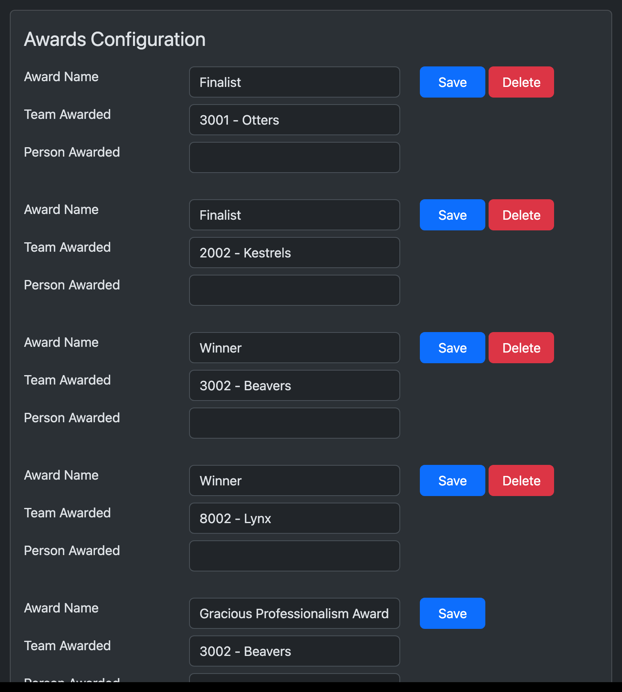

**Lower thirds** are the captions across the bottom of the audience display. **Setup > Lower Thirds** lists the
award ones; add your own (for example sponsors or speakers) in the empty row at the bottom.

**Sponsor slides.** Create `static/img/sponsors/`, copy the images there, and add each one on **Setup > Sponsor
Slides** with how many seconds to show it. They play when the audience display is set to **Sponsor Reel**.

### The day before: a dry run

- [ ] The FMS computer is at 10.0.100.5 and the FMS starts without `-dev`.
- [ ] Settings: name, 2v2 on, playoff type, 4 alliances, PLC address, automated audience display.
- [ ] Every team is entered with its details; numbers follow the rules above.
- [ ] WPA keys generated, `keys.csv` loaded into the kiosk, and one 5-digit radio tested.
- [ ] The qualification schedule is saved. With the first match loaded on Match Play, the match queue display shows it.
- [ ] Every display is set up and nicknamed, and the audience display plays sound.
- [ ] Every tablet opens its page and shows the right title.
- [ ] **Setup > Field Testing:** every sound plays; the PLC's e-stops and stack lights work.
- [ ] A test match with every robot connected runs from start to Commit & Post.
- [ ] Awards are entered.
- [ ] A copy of the database is saved off the FMS computer.

## 4. Running Medieval Mayhem

### One match, step by step

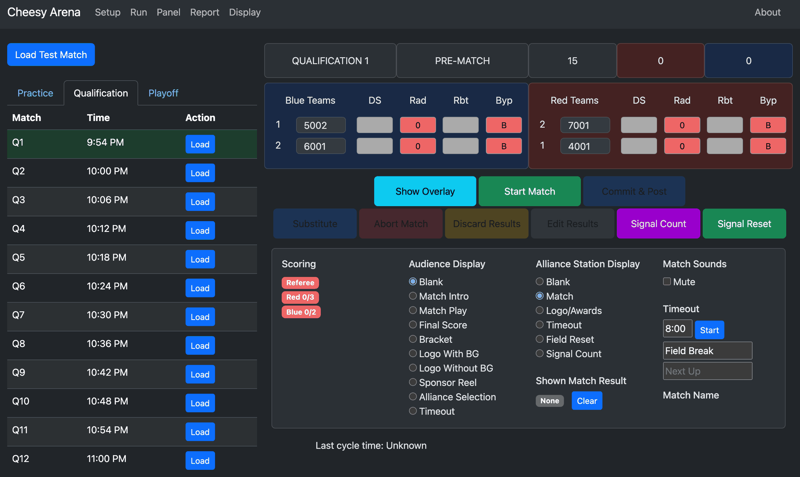

| | FMS operator | Scorers | Head referee and referees |
|---|---|---|---|
| 1 | The next match loads by itself after each posted score (or click **Load**). The intro shows on the audience display | Check the title shows the new match | |
| 2 | When the teams are set, check every station: DS, radio and robot green. Bypass a station with no robot (**B**) | | |
| 3 | **Start Match**. If it stays grey, hover over it to see why | | |
| 4 | Watch Match Play and the field | Enter the match as it happens | Enter fouls as they happen |
| 5 | The match ends by itself | Check and **Commit** | Head referee: give cards |
| 6 | Watch the scoring badges: Referee, Red n/n, Blue n/n | | Head referee: when all scorers have committed, **Commit & Post** |
| 7 | The final score shows; the next match loads | | |

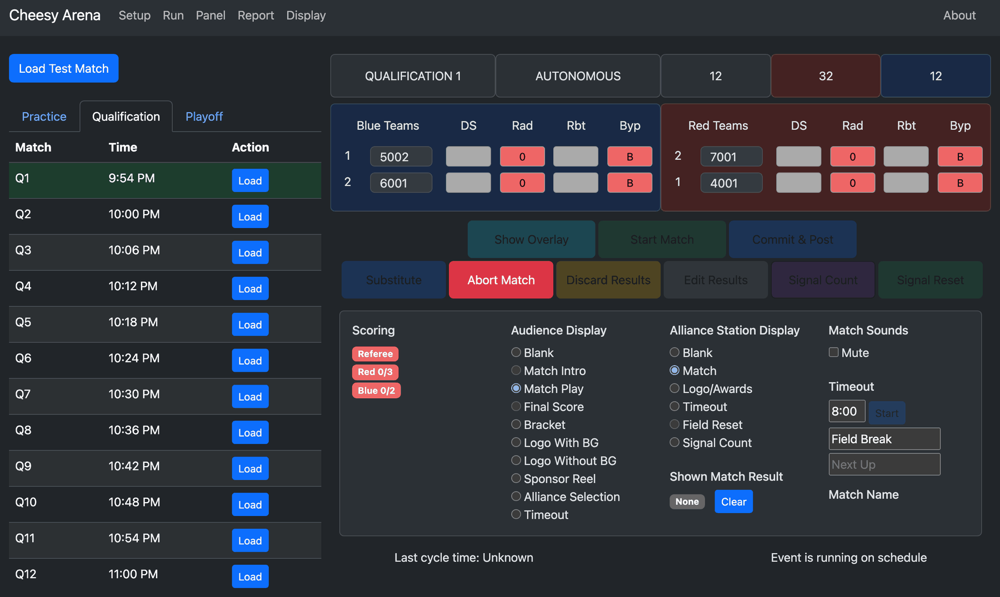

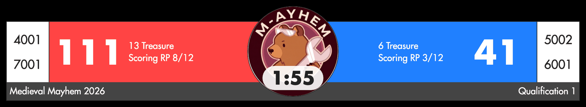

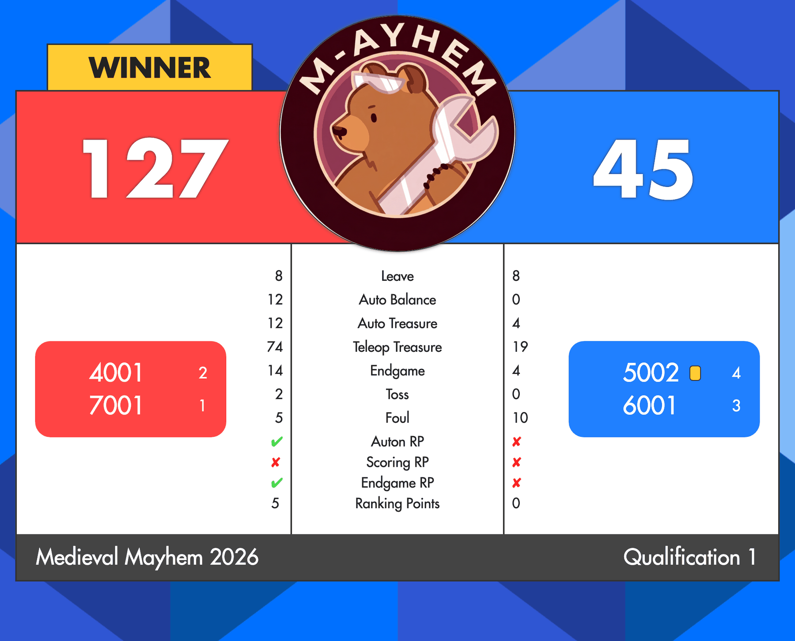

The operator can also post from Match Play with **Commit & Post**; it asks first if a scorer hasn't committed.

### When something goes wrong

| Problem | What to do |
|---|---|
| A team doesn't show up | Bypass its station (**B**) and start. Nothing is scored for it |
| A robot is unsafe during a match | The head referee taps **Disable** for it on their page |
| Field fault; the match must be replayed | **Abort Match**, then **Discard Results**. The same match loads again |
| A scorer's mistake, before posting | After the match, **Edit Results** on Match Play fixes the score before it is posted |
| A mistake found after posting | **Run > Match Review**, then **Edit** (below) |
| A field break or timeout | Match Play's **Timeout** box: set the time and description, then **Start**. The displays show a countdown. **Abort Match** ends it early |
| A display is blank or stuck | **Setup > Display Configuration**: reload that display |

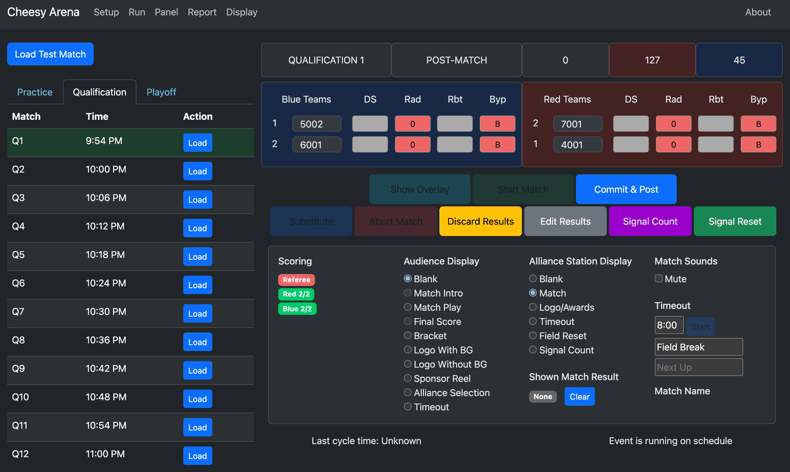

### Looking up and changing a result

**Run > Match Review** lists every match with its score and ranking-point marks. **Edit** opens the full result:
treasures, each robot's leave, balance and endgame, the crown, the toss, fouls and cards, with a running summary.
**Save** recalculates the rankings at once.

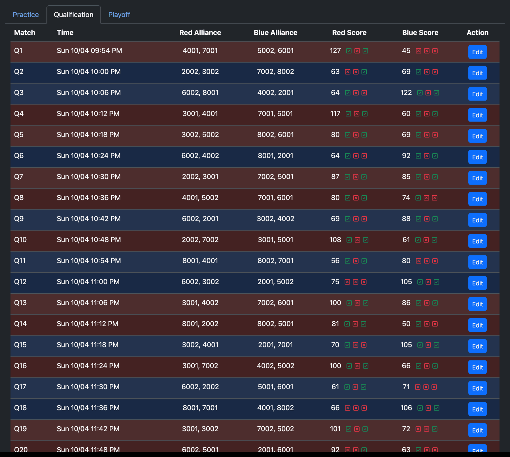

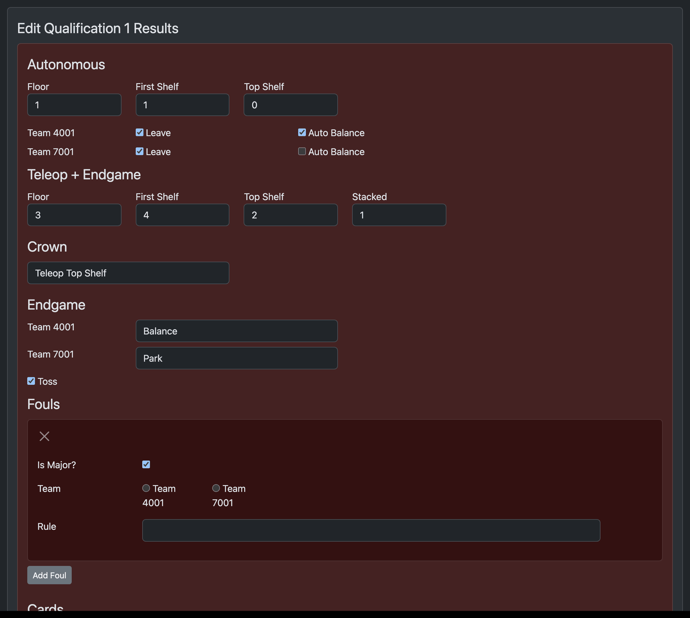

To show a past result on the audience display, click **Show Result** next to the match on Match Play, then choose
**Final Score**.

### Alliance selection

1. After the last qualification match, open **Run > Alliance Selection** and click **Start Alliance Selection**.
2. Set the audience display to **Alliance Selection** (the radio buttons on the same page).
3. Type each captain, then each pick, pressing **Enter** after each. In 2v2 each alliance is a captain and one pick.
4. The **Timer** counts down on the audience display: 45 s for the first round, or set your own.
5. Click **Finalize Alliance Selection** and enter the time the playoffs start. The playoff schedule is made, and
   Match Play opens on the first playoff match.

**Reset Alliance Selection** starts over, until the first playoff match is played.

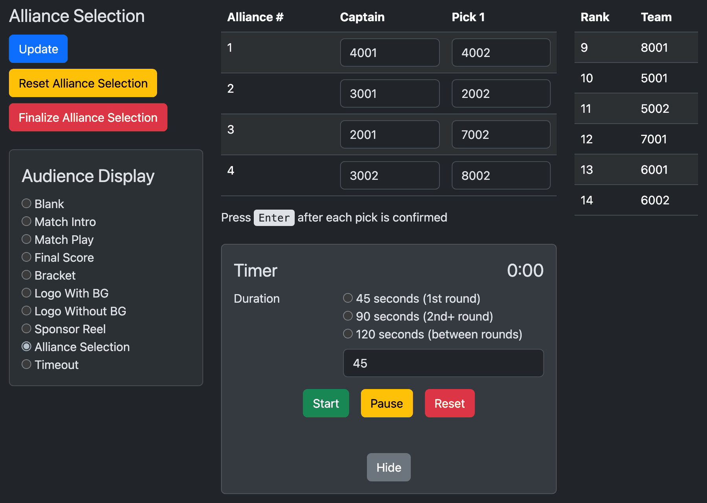

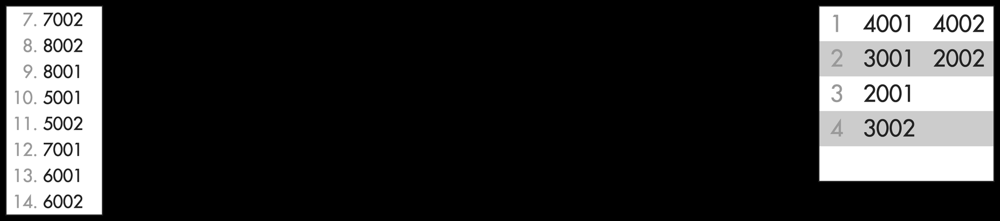

### Playoffs

Matches run the same way as qualification matches.

- Every round before the final is one game. A tie is broken by fewer major fouls, then auton points, then points
  without fouls. A true tie plays another game of that round. The final score's banner says how a tie was decided.
- The final is best of 3.
- An 8-minute field break starts by itself before each final game. Click **Abort Match** to end it early.
- Cards apply to the whole alliance, and a red card disqualifies it.

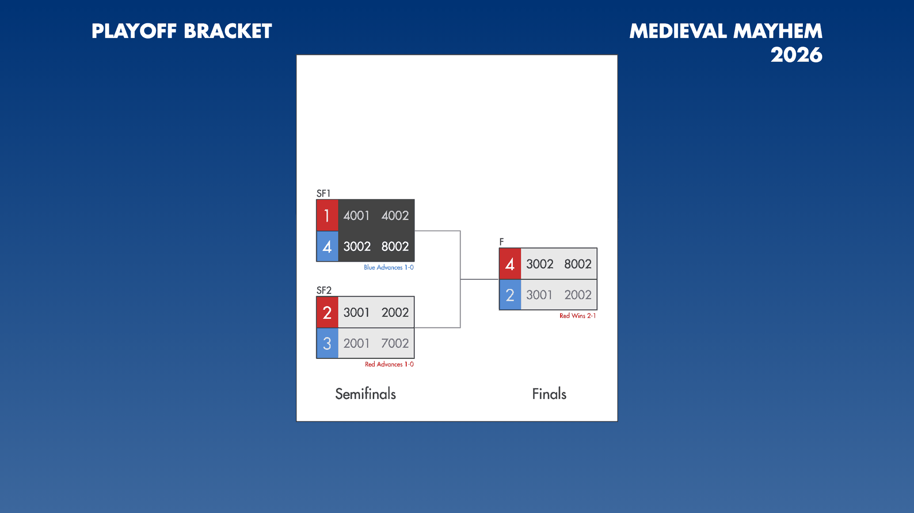

### Awards presentation

1. Set the audience display to **Blank** or a logo.
2. On **Setup > Lower Thirds**, click **Show** on an award's first lower third (its name), then **Show** on the second
   (its winner). **Show Only Thirds** blanks the rest of the audience display first.
3. **Hide** removes it.
4. On Match Play, set the screens above the driver stations to **Logo/Awards**.

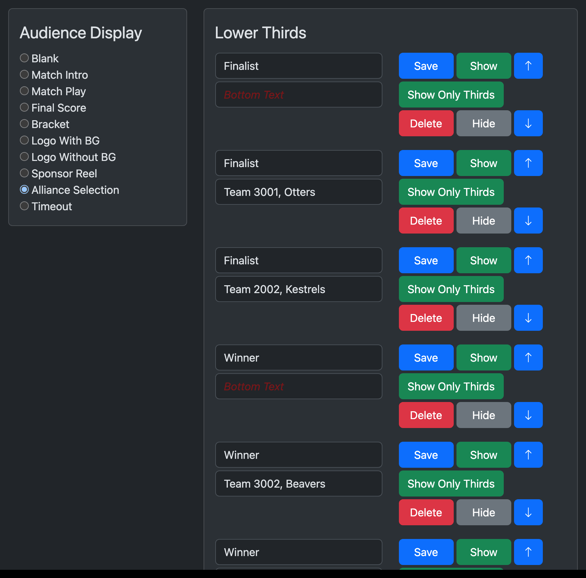


### End of the day

- **Report** menu: standings, schedules, the bracket and the team list as PDF or CSV.
- **Setup > Settings > Save Copy of Database**, and keep the file off the FMS computer.

## 5. Appendix

### Page addresses

Replace `10.0.100.5` with `localhost` on your own computer.

| Page | Address |
|---|---|
| Match Play | `http://10.0.100.5:8080/match_play` |
| Settings | `http://10.0.100.5:8080/setup/settings` |
| Team List | `http://10.0.100.5:8080/setup/teams` |
| Match Scheduling | `http://10.0.100.5:8080/setup/schedule` |
| Display Configuration | `http://10.0.100.5:8080/setup/displays` |
| Match Review | `http://10.0.100.5:8080/match_review` |
| Alliance Selection | `http://10.0.100.5:8080/alliance_selection` |
| New display | `http://10.0.100.5:8080/display` |
| Scoring | `http://10.0.100.5:8080/panels/scoring/red_near` (also `red_far`, `blue_near`, `blue_far`, `red`, `blue`) |
| Head referee | `http://10.0.100.5:8080/panels/referee` |
| Referee | `http://10.0.100.5:8080/panels/referee?hr=false` |

The scoring and referee pages are also in the **Panel** menu.

### Troubleshooting

| Problem | Likely cause |
|---|---|
| Start Match stays grey | Hover over it. Usually a station with no robot and no bypass, an e-stop, or a PLC address set with no PLC connected |
| "No schedule template exists" | With 2v2 on, there must be exactly 14 teams and 8, 10 or 12 matches per team |
| 2v2 Mode can't be changed | A qualification schedule exists. **Clear Qualification Data** first (makes a backup) |
| Teams can't be added or deleted | A qualification schedule exists |
| The score badges never turn green | Every scoring page open for an alliance must commit, including a spare one left open on another device. Close extra pages, or commit them |
| No sound | The audience display page is the only one that plays sound; check its speakers and that the browser allows audio |
| Settings won't save | A match is running or not yet posted |

### Recovering from a bad state

**Setup > Settings > Load Database from Backup** restores any file from `db/backups/` or one you saved. It makes a
backup of the current event first.
