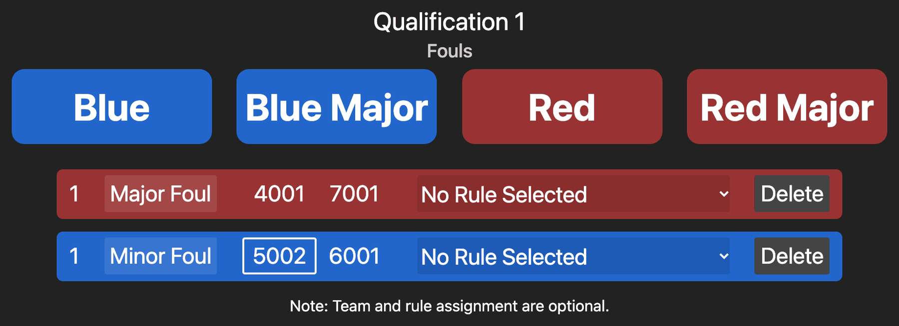
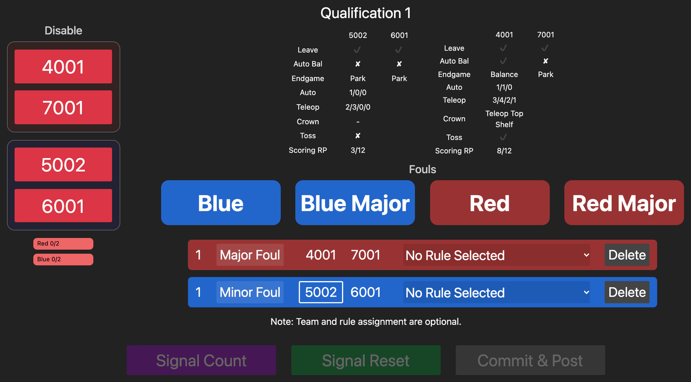
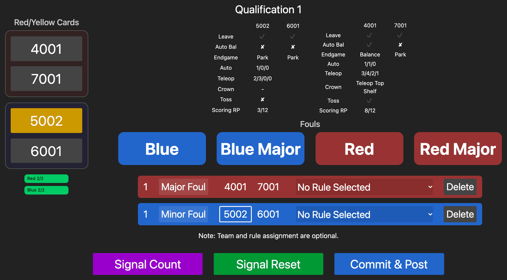

# Medieval Mayhem Referee Manual

For the head referee and the other referees, who enter fouls and cards on a tablet. The foul list is the game
manual's section 4.5, word for word ([specs/RULES.md](../specs/RULES.md)). Print the one-page
[foul card](FOUL_CARD.md) to keep at hand: every foul code with a short gist, minor and major, and the ones that give
the other alliance a ranking point.

## Before the event

1. Connect the tablet to the field Wi-Fi. The FMS operator gives you its name and password.
2. Open the FMS in Chrome (or Safari on an iPad) at `http://10.0.100.5:8080`, then choose your page from the
   **Panel** menu: **Head Referee** or **Referee**.

   

   Or type its address:

   | You are | Page |
   |---|---|
   | Head referee | `http://10.0.100.5:8080/panels/referee` |
   | Other referees | `http://10.0.100.5:8080/panels/referee?hr=false` |

3. If you see a login page, the username is `admin`; the operator gives you the password. You only log in once.
4. Use **Add to Home Screen** in the browser menu so the page opens full screen like an app.

Every referee page shows the same fouls, live: a foul one referee adds appears on all the others.

## Entering a foul (every referee)

1. Tap the button for the alliance that **committed** the foul: **Blue** or **Red** for a minor foul, **Blue Major**
   or **Red Major** for a major foul. The points go to the other alliance: 5 for a minor foul, 10 for a major one.
2. Optionally tap the team that committed it.
3. Choose the rule from the list. Rules marked **+ RP** also give the other alliance a ranking point, but only when
   that rule is chosen:

   | Rule | Gives the other alliance |
   |---|---|
   | MA2603 | the Auton ranking point |
   | MA2601, MA2602 | the Endgame ranking point |

4. Entered the wrong severity? Tap the **Minor Foul** / **Major Foul** label to switch it (this clears the rule).
   Entered it by mistake? Tap **Delete**.

The page reminds you that team and rule are optional. They are, except for the three rules above: without the rule,
no ranking point is given.

## Head referee

The head referee's page also has the team buttons on the left, a live summary of what the scorers have entered,
and three buttons at the bottom.

**The team buttons** do different things at different times:

| When | Label | What a tap does |
|---|---|---|
| Before the match | Bypass | Bypasses that station, as on the FMS operator's screen (asks to confirm) |
| During the match | Disable | Disables that robot (asks to confirm) |
| After the match | Red/Yellow Cards | Cycles the card: none, yellow, red, none |

In qualification matches a card applies to that team. A team that already has a yellow card from an earlier match
goes straight to red. In playoff matches a card applies to the whole alliance, and a red card disqualifies the alliance.

**The live summary** shows each robot's leave, auto balance and endgame, each alliance's treasure counts (auto
floor/first/top and teleop floor/first/top/stacked), the crown, the toss and Scoring ranking point progress. Use it
to check the scorers before you post.

**Signal Count** and **Signal Reset** show COUNT or FIELD RESET on the screens at the driver stations. Signal Reset
also plays the field-reset sound and turns on the field-reset light.

## Posting the score (head referee)

1. Give any cards.
2. Wait for every scorer to commit. The badges under the team buttons turn green ("Red 2/2", "Blue 2/2"). They
   count every scoring page open for that alliance, so a spare page left open keeps them red.
3. Tap **Commit & Post**. The score goes up on the audience screen and the FMS loads the next match.

Commit & Post works before every scorer has committed (it asks you to confirm), but the missing entries are then
posted as they are. Wait unless you know they are complete.

## After a match

If a team asks about a score, the FMS operator can show the posted result and correct it in Match Review. Corrections
update the rankings right away.
