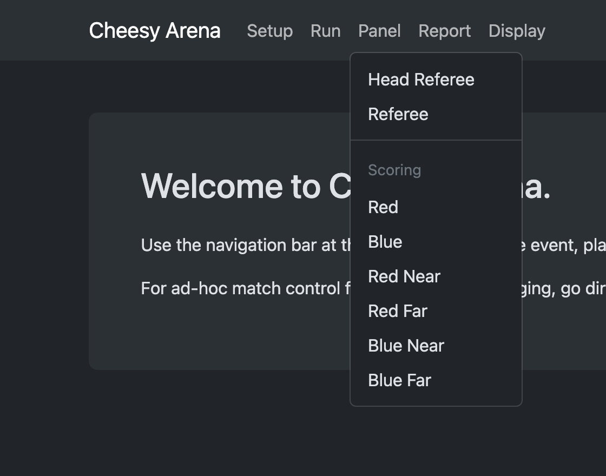
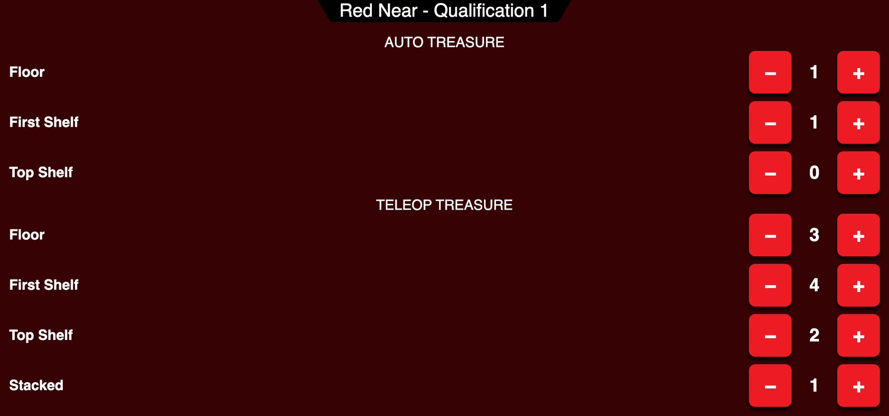
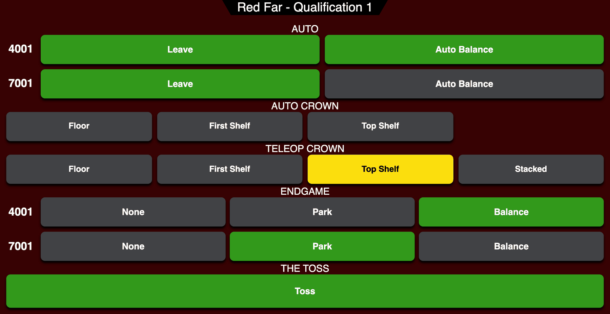
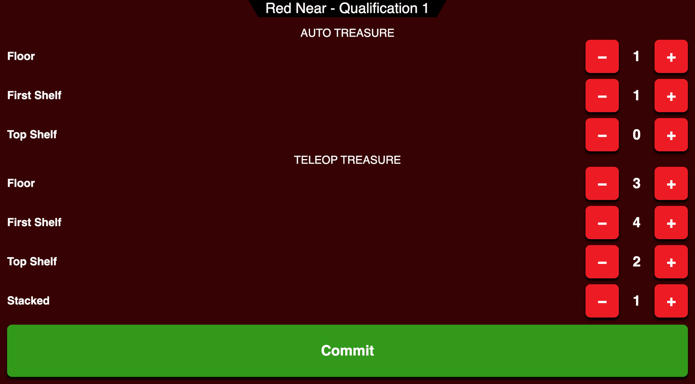

# Medieval Mayhem Scorer Manual

For the volunteers who score Medieval Mayhem matches on a tablet. Each alliance has two scorers:

- **Near scorer:** the treasures, by level.
- **Far scorer:** everything else: each robot's leave, auto balance and endgame, the crown, and the toss.

The head referee posts the score once both scorers on both alliances have committed. Fouls are not your job: the
referees enter them.

## Before the event

1. Connect the tablet to the field Wi-Fi. The FMS operator gives you its name and password.
2. Open the FMS in Chrome (or Safari on an iPad) at `http://10.0.100.5:8080`, then choose your page from the
   **Panel** menu, under **Scoring**:

   

   Or type its address:

   | You are | Page |
   |---|---|
   | Red near scorer | `http://10.0.100.5:8080/panels/scoring/red_near` |
   | Red far scorer | `http://10.0.100.5:8080/panels/scoring/red_far` |
   | Blue near scorer | `http://10.0.100.5:8080/panels/scoring/blue_near` |
   | Blue far scorer | `http://10.0.100.5:8080/panels/scoring/blue_far` |

   If the operator asks one person to score a whole alliance, choose **Red** or **Blue** instead: it shows both halves
   on one page.
3. If you see a login page, the username is `admin`; the operator gives you the password. You only log in once.
4. Use **Add to Home Screen** in the browser menu so the page opens full screen like an app.
5. Check the title at the top, for example "Red Near - Qualification 3": it names your alliance, your side and the
   match that is loaded.

The buttons stay grey until the match starts.

## Near scorer: treasures

- **Auto treasure:** tap **+** for each treasure scored during autonomous, under the level it is on: Floor, First
  Shelf or Top Shelf.
- **Teleop treasure:** the same for the rest of the match, plus **Stacked**.
- Tapped one too many? Tap **−**. A counter never goes below zero.
- Do not count the crown. The far scorer enters it.

## Far scorer: robots, the crown and the toss

Each robot has its own row, labelled with its team number. In 2v2 there are two rows.

- **Leave:** tap when the robot earns Leave in autonomous, as the game manual defines it.
- **Auto Balance:** tap when the robot earns Auto Balance. This also turns on Leave, because the robot had to leave
  its safe house to reach the beam. If that is wrong, tap Leave to turn it off.
- **Crown:** tap where the crown ends up: under **Auto Crown** if it was placed during autonomous, otherwise under
  **Teleop Crown**. There is only one crown; tapping another spot moves it, and tapping the lit spot clears it.
- **Endgame:** at the end of the match, choose **None**, **Park** or **Balance** for each robot.
- **The Toss:** tap when your alliance's toss treasure goes in. Tap again to undo.

## After the match

1. When the match ends, a green **Commit** button appears.
2. Check your entries and fix anything that is off.
3. Tap **Commit**. The page locks until the next match is loaded.

If you notice a mistake after committing, tell the head referee right away. Before the score is posted they can wait
for the FMS operator to fix it; after it is posted, the operator can still correct it in Match Review.

## Points, for reference

| Element | Auto | Teleop |
|---|---|---|
| Floor treasure | 4 | 2 |
| First Shelf treasure | 8 | 5 |
| Top Shelf treasure | 12 | 10 |
| Stacked treasure | | 8 |
| Crown | twice the treasure value of its spot | twice the treasure value of its spot |
| Leave, per robot | 4 | |
| Auto Balance, per robot | 12 | |
| Park / Balance, per robot | | 2 / 12 |
| The Toss | | 2 |

The audience screen shows each alliance's treasure count and its progress toward the Scoring ranking point: teleop
treasures on the first shelf, top shelf or stacked, with the crown counting as one.

## If something goes wrong

- **The page says it is disconnected, or nothing changes when you tap:** reload the page. Your entries are kept on
  the FMS, not the tablet.
- **The title shows the wrong match:** tell the FMS operator; they load the matches.
- **The buttons are grey during a match:** reload. If they stay grey, tell the FMS operator.
